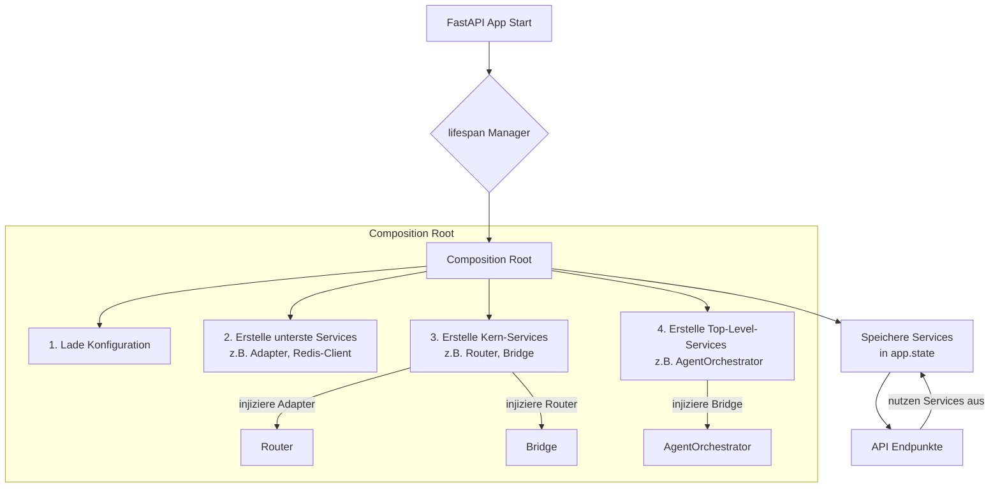

# LLM2LLM-Bridge Architektur

## Dependency Injection (DI) und Composition Root

Das Herzstück unserer Architektur ist das Prinzip der **Dependency Injection**. Anstatt dass Komponenten ihre eigenen Abhängigkeiten erstellen (enges Coupling), werden ihnen diese von außen über den Konstruktor "injiziert".

### Warum dieser Ansatz?

* **Testbarkeit:** In Tests können wir echte Abhängigkeiten (wie eine Datenbankverbindung) einfach durch "Mocks" ersetzen. Dies ermöglicht schnelle, isolierte Unit-Tests.
* **Wartbarkeit:** Komponenten haben klare "Verträge" (Interfaces/Protocols) und können ausgetauscht werden, ohne den Code zu brechen, der sie verwendet.
* **Flexibilität:** Die gesamte Anwendung wird an einem einzigen, zentralen Ort, der **Composition Root**, zusammengebaut.

### Architektur-Übersicht



## Komponenten-Übersicht

### 1. **Service Container** (`app/core/di/container.py`)

Der zentrale DI-Container, der alle Services verwaltet:

```python
container = ServiceContainer()

# Singleton registration
container.register_singleton(IConfigurationProvider, 
    lambda: ConfigurationService(config_path))

# Transient registration
container.register_transient(IAdapter, 
    lambda: AdapterFactory())

# Resolution
config = await container.resolve(IConfigurationProvider)
```

**Lebenszyklus-Unterstützung:**
- **Singleton:** Eine Instanz für die gesamte Anwendungslaufzeit
- **Transient:** Neue Instanz bei jeder Anfrage
- **Scoped:** Eine Instanz pro Request (für Web-Anwendungen)

### 2. **Interfaces** (`app/core/di/interfaces.py`)

Definiert klare Verträge für alle Services:

```python
class IRouter(Protocol):
    """Interface for message routing"""
    async def route_message(self, 
                          conversation_id: str, 
                          target_llm_name: str, 
                          prompt: str, 
                          **kwargs) -> str:
        ...

class IEventStore(Protocol):
    """Interface for event logging"""
    async def log_event(self, event_type: str, data: Dict[str, Any]) -> None:
        ...
```

### 3. **Composition Root** (`app/api/composition_root.py`)

Der zentrale Ort, an dem alle Abhängigkeiten verdrahtet werden:

```python
async def configure_services(config_path: Optional[Path] = None) -> ServiceContainer:
    container = ServiceContainer()
    
    # Register all services
    container.register_singleton(IConfigurationProvider, ...)
    container.register_singleton(ILogger, ...)
    container.register_singleton(IEventStore, ...)
    # ... weitere Services
    
    # Complex service with dependencies
    async def create_router():
        config = await container.resolve(IConfigurationProvider)
        adapters = await create_all_adapters(config)
        # ... create router with all dependencies
        return Router(adapters, circuit_breakers, ...)
    
    container.register_singleton(IRouter, create_router)
    
    return container
```

## Hauptkomponenten

### LLMBridgeCore (`app/core/core_di.py`)

Die zentrale Bridge-Komponente mit injected dependencies:

```python
class LLMBridgeCore:
    def __init__(self,
                 router: IRouter,
                 config_provider: IConfigurationProvider,
                 event_store: IEventStore,
                 telemetry: ITelemetry,
                 logger: Optional[ILogger] = None):
        # Alle Abhängigkeiten werden injiziert
        self.router = router
        self.config_provider = config_provider
        # ...
```

### Router (`app/core/routing/router_di.py`)

Der Router mit allen injizierten Services:

```python
class Router(IRouter):
    def __init__(self,
                 adapters: Dict[str, Any],
                 circuit_breakers: Dict[str, Any],
                 model_config: Dict[str, Any],
                 event_store: IEventStore,
                 telemetry: ITelemetry,
                 redis_provider: Optional[IRedisProvider] = None,
                 logger: Optional[ILogger] = None):
        # Initialisierung mit injizierten Abhängigkeiten
```

## Testing mit DI

### Test-Container (`tests/conftest.py`)

Zentrale Test-Fixture für konsistente Mocks:

```python
@pytest.fixture
def test_container():
    """Creates a DI container for tests with mocked dependencies"""
    container = ServiceContainer()
    
    # Register mocks
    mock_router = AsyncMock(spec=IRouter)
    container.register_singleton(IRouter, lambda: mock_router)
    
    # ... weitere Mocks
    return container
```

### Beispiel-Test

```python
@pytest.mark.asyncio
async def test_bridge_endpoint(test_client, test_container):
    # Arrange
    mock_router = await test_container.resolve(IRouter)
    mock_router.route_message.return_value = "Test response"
    
    # Act
    response = await test_client.post("/v1/bridge", json={...})
    
    # Assert
    assert response.status_code == 200
    mock_router.route_message.assert_awaited_once_with(...)
```

## Vorteile der DI-Architektur

1. **Lose Kopplung:** Komponenten kennen nur Interfaces, keine konkreten Implementierungen
2. **Einfaches Testing:** Mocks können problemlos injiziert werden
3. **Flexibilität:** Implementierungen können zur Laufzeit ausgetauscht werden
4. **Klarheit:** Alle Abhängigkeiten sind explizit im Konstruktor sichtbar
5. **Zentrale Konfiguration:** Die gesamte Anwendung wird an einem Ort konfiguriert

## Best Practices

1. **Verwende immer Interfaces:** Definiere Protokolle für alle Services
2. **Constructor Injection:** Injiziere Abhängigkeiten nur über den Konstruktor
3. **Keine Service Locator:** Vermeide globale Container-Zugriffe im Code
4. **Ein Composition Root:** Nur ein zentraler Ort für die Verdrahtung
5. **Async-aware:** Nutze async/await für asynchrone Initialisierung

## Migration von Legacy-Code

Von:
```python
class OldService:
    def __init__(self):
        self.db = Database()  # Direkte Erstellung
        self.logger = logging.getLogger()  # Global
```

Zu:
```python
class NewService:
    def __init__(self, db: IDatabase, logger: ILogger):
        self.db = db  # Injiziert
        self.logger = logger  # Injiziert
```

Diese Architektur macht LLM2LLM-Bridge zu einer robusten, testbaren und wartbaren Plattform.