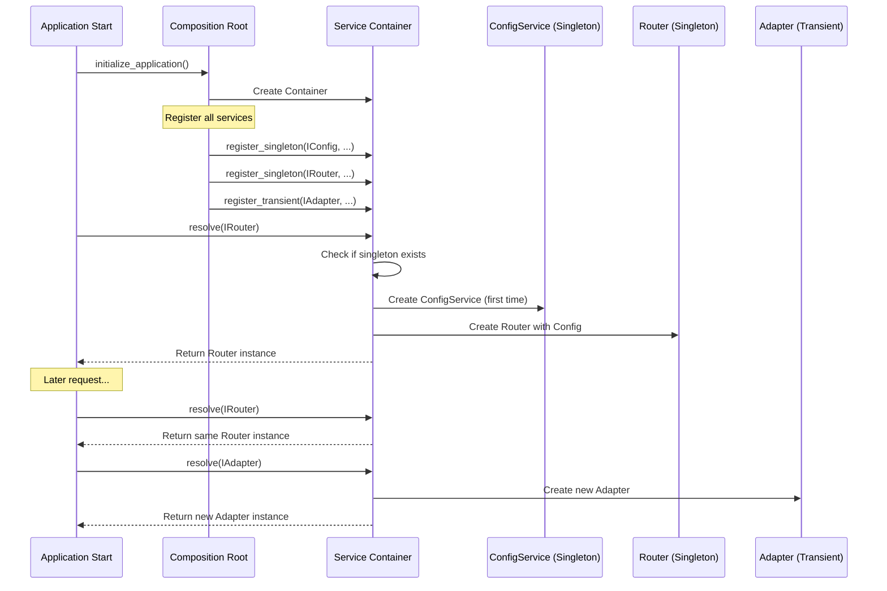
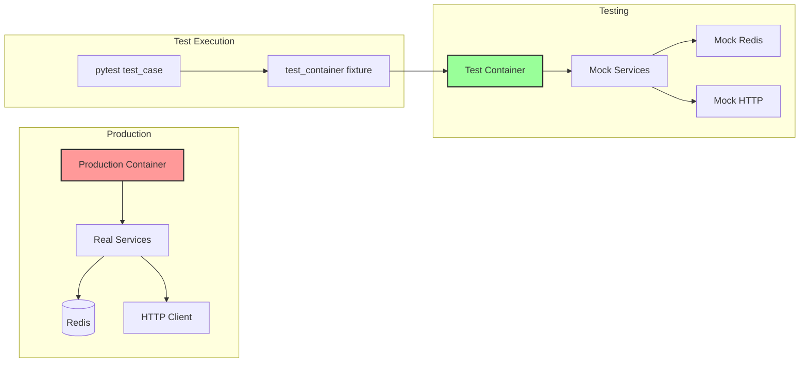
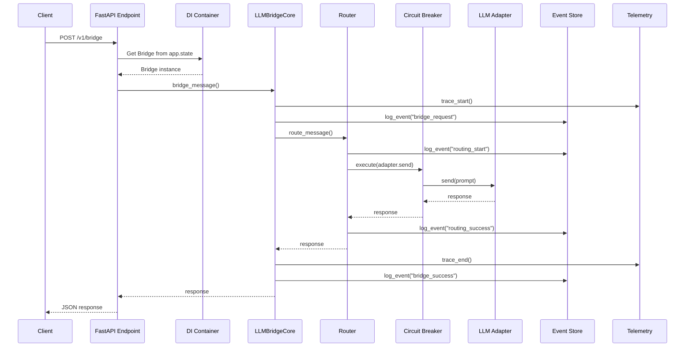
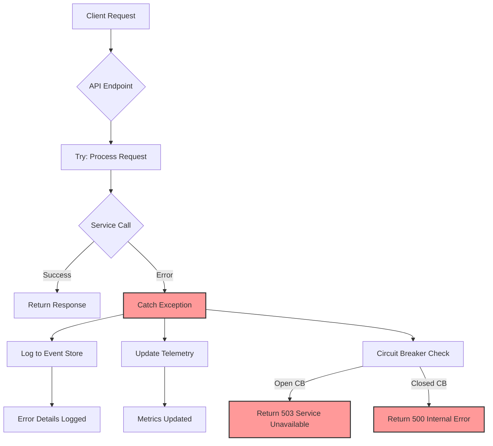
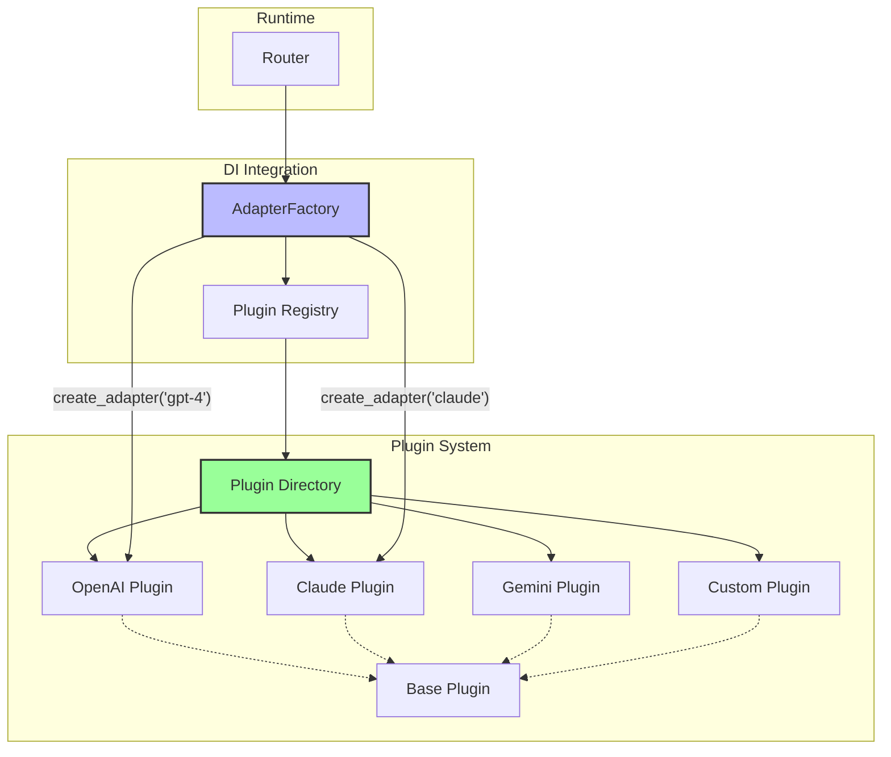
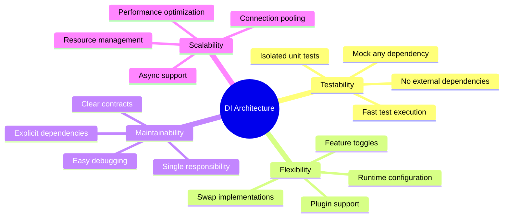

# Visual Guide: LLM2LLM-Bridge DI Architecture

## Component Dependency Graph

```mermaid
graph TB
    subgraph "API Layer"
        API[FastAPI App]
        EP1[/v1/bridge]
        EP2[/v1/mission/execute]
        EP3[/v1/models]
    end
    
    subgraph "Core Services"
        Bridge[LLMBridgeCore]
        Router[Router]
        Orch[AgentOrchestrator]
    end
    
    subgraph "Infrastructure Services"
        Config[ConfigurationProvider]
        EventStore[EventStore]
        Telemetry[TelemetryService]
        Logger[LoggerService]
        Redis[RedisProvider]
        HTTP[HTTPClientProvider]
    end
    
    subgraph "Factories"
        AdapterFactory[AdapterFactory]
        CBFactory[CircuitBreakerFactory]
    end
    
    subgraph "Adapters"
        OpenAI[OpenAIAdapter]
        Claude[ClaudeAdapter]
        Gemini[GeminiAdapter]
        OR[OpenRouterAdapter]
    end
    
    API --> Bridge
    API --> Orch
    
    EP1 --> Bridge
    EP2 --> Orch
    EP3 --> Bridge
    
    Bridge --> Router
    Bridge --> Config
    Bridge --> EventStore
    Bridge --> Telemetry
    
    Router --> EventStore
    Router --> Telemetry
    Router --> Redis
    
    Orch --> Bridge
    Orch --> EventStore
    Orch --> Telemetry
    
    AdapterFactory --> HTTP
    AdapterFactory --> Config
    
    AdapterFactory -.-> OpenAI
    AdapterFactory -.-> Claude
    AdapterFactory -.-> Gemini
    AdapterFactory -.-> OR
    
    Router --> AdapterFactory
    Router --> CBFactory
    
    style API fill:#f9f,stroke:#333,stroke-width:2px
    style Bridge fill:#bbf,stroke:#333,stroke-width:2px
    style Router fill:#bbf,stroke:#333,stroke-width:2px
```

## Service Lifetime Flow



## Testing Architecture



## Request Flow Through DI Components



## Error Handling Flow



## Plugin Architecture Integration



## Key Benefits Visualized



This visual guide helps developers quickly understand the DI architecture and how components interact within the LLM2LLM-Bridge system.